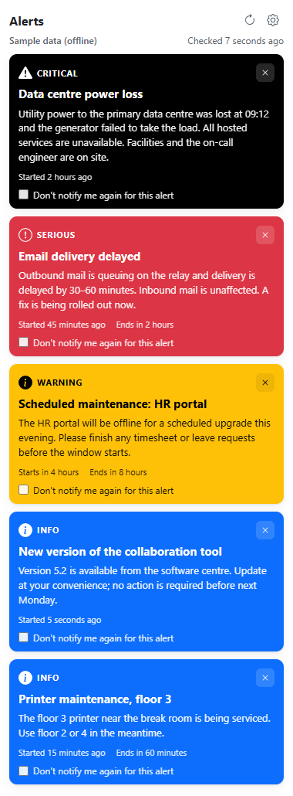
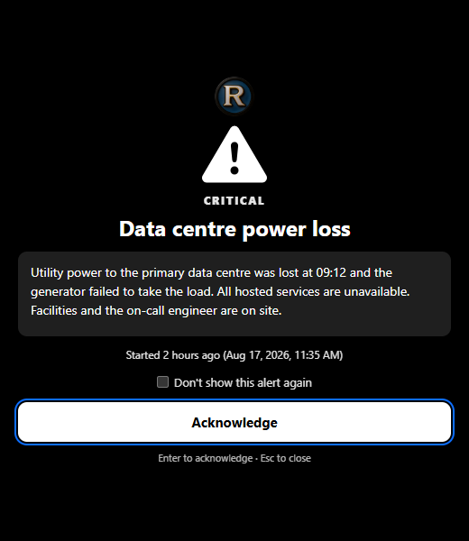
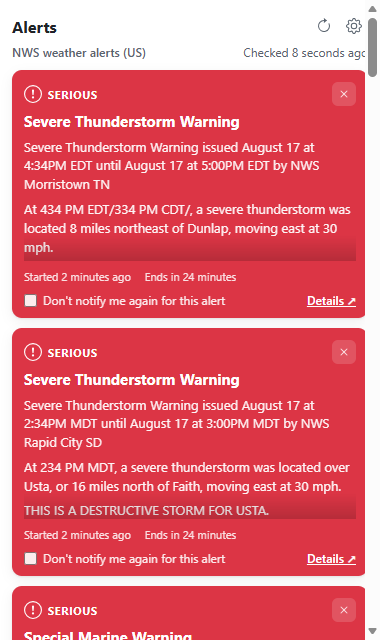
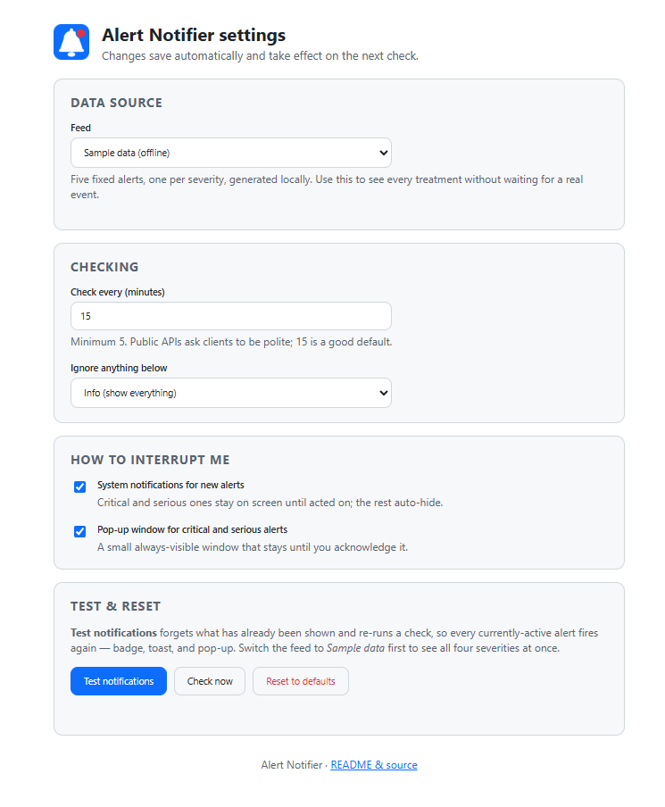

# Alert Notifier

A Manifest V3 browser extension (Chrome, Edge, Brave — anything Chromium) that
watches an alert feed in the background and escalates anything new through
three levels of interruption:

| Level | What the user sees | When |
|---|---|---|
| **Badge** | Count on the toolbar icon, coloured by the worst active alert | Always, for every visible alert |
| **Notification** | An OS toast. Critical/serious ones stay until acted on | Every new alert |
| **Modal window** | A small pop-up window that stays until acknowledged | New **critical** or **serious** alerts |

Out of the box it watches **US National Weather Service alerts** — nationwide,
filtered to Extreme + Severe, or any state you pick — a live, public, keyless feed with a native severity field, so the whole
escalation ladder can be seen with real data. A second adapter watches
**GitHub Status** incidents. A third is offline **sample data** so every
treatment can be demonstrated on demand.

> **Where this came from.** The original was an internal tool: an extension
> that polled a company's outage API and made sure nobody missed a critical
> incident. This is that architecture, rebuilt for the public with the
> internal feed replaced by pluggable public sources. Adding your own feed is a
> ~30-line adapter — see [Adding a data source](#adding-a-data-source).

No build step. No runtime dependencies. Vanilla ES modules, ~1,600 lines
including comments — and it is *heavily* commented, because the interesting
part of a service-worker extension is the *why* (see
[background.js](background.js) for what MV3 does to your assumptions).

<p align="center">
  
  &nbsp;&nbsp;
  
</p>
<p align="center">
  
  &nbsp;&nbsp;
  
</p>
<p align="center"><sub>Left to right: sample data (all four severities) · the modal for a critical alert · a live NWS heat warning · settings.</sub></p>

---

## Install (unpacked, 60 seconds)

There is no store listing yet; you load the folder directly. This is how
extension developers run everything, and it survives browser restarts.

1. **Get the code**
   ```bash
   git clone https://github.com/mattrogers587-source/alert-notifier.git
   ```
   or download the ZIP from the green **Code** button and extract it. Node is
   **not** required to run the extension (only for the tests).

2. **Open the extensions page**
   - Chrome / Brave: `chrome://extensions`
   - Edge: `edge://extensions`

3. **Turn on Developer mode** — toggle in the top-right (Chrome) or left
   sidebar (Edge).

4. **Load unpacked** → select the `alert-notifier` folder (the one containing
   `manifest.json`).

5. **Pin it**: click the puzzle-piece icon in the toolbar and pin
   *Alert Notifier* so the badge is visible.

That's it. It polls immediately on install, then every 15 minutes.

### First-run walkthrough

- Click the icon. You will see the current **nationwide Extreme + Severe** NWS
  alerts (there is nearly always at least one), or *All clear*.
- Click the gear → **Settings**. Set **Region** to your state to see everything
  local, or stay nationwide and adjust the severity floor.
- To see every treatment at once: set **Feed** to *Sample data (offline)*,
  then press **Test notifications**. You will get five toasts, two modal
  windows (critical + serious), and a black badge showing **5**.
- Switch the feed back to NWS when you are done; the sample data is only for
  demos and tests.

### Windows notification checklist

If toasts do not appear: Windows **Settings → System → Notifications** — make
sure notifications are on for your browser and *Focus assist / Do not disturb*
is off. Chrome and Edge each appear as their own app in that list.

---

## Using it

### The popup
Cards are sorted most-severe first. Each shows severity, title, the body text
(long NWS bulletins are trimmed with a fade; the modal or *Details ↗* has the
full text), start/end times, and two controls:

- **✕ Dismiss** — hides this alert from the popup and badge. It stays hidden
  until the source stops reporting it; if it later comes back it is treated as
  new again.
- **Don't notify me again for this alert** — the alert stays *visible* but
  will not toast or open a modal again. Use it for a multi-day heat warning you
  already know about.

The popup shows at most 25 cards (worst first) and says how many more there
are — nationwide NWS can run to 70+; the badge always has the true count.

Header buttons: **↻ Check now** and **⚙ Settings**. Under the title: which feed
is active and when it was last checked (hover for the exact time). If the last
check failed, a yellow banner says why and the previous alerts stay put.

### The modal window
Opens for new critical/serious alerts (configurable). **Acknowledge** or
`Enter` closes it; `Esc` closes without touching anything; the checkbox
silences that alert going forward. It reads the alert from storage by ID, so if
the alert cleared in the seconds between the poll and the window opening it
says so instead of showing stale text.

### Settings (right-click the icon → Options, or the gear)
Everything autosaves.

| Setting | Default | Notes |
|---|---|---|
| Feed | NWS weather alerts | Per-feed options appear underneath: **Region** (nationwide or a state) and the **severity floor** the NWS server applies before download |
| Check every | 15 min | Minimum 5 — be polite to public APIs |
| Ignore anything below | Info | e.g. *Serious* keeps only critical + serious |
| System notifications | on | |
| Pop-up window for critical/serious | on | |
| Test notifications | — | Forgets what was already shown and re-polls, so everything active fires again |
| Reset to defaults | — | Two-click confirm |

---

## How it works

```
 chrome.alarms (every N min)          popup.html / options.html
          │                                    │  runtime.sendMessage
          ▼                                    ▼
 ┌──────────────────────── background.js (service worker) ────────────────────────┐
 │  loadSettings() ─▶ getSource(id).fetchAlerts(opts) ─▶ Alert[]                   │
 │        │                                                                        │
 │        ▼  lib/state.js (pure)                                                   │
 │  activeOnly → filter ≥ minSeverity → visibleAlerts(dismissed) → newAlerts(last, │
 │  silenced) → pruneIds                                                           │
 │        │                                                                        │
 │        ├─▶ storage.local  { currentAlerts, lastIds, dismissedIds, silencedIds } │
 │        ├─▶ action.setBadgeText / Color        (count + worst severity)          │
 │        ├─▶ notifications.create               (each new alert)                  │
 │        └─▶ windows.create(alert.html?id=…)    (new critical/serious)            │
 └─────────────────────────────────────────────────────────────────────────────────┘
```

Things worth knowing, all spelled out in comments in the code:

- **Why `chrome.alarms` and not `setInterval`** — MV3 service workers are
  killed after ~30 s idle. The browser owns the schedule and wakes the worker.
- **Why all state is in `chrome.storage.local`** — module-level variables
  reset every time the worker restarts.
- **Why listeners are registered synchronously at top level** — otherwise
  there is nothing for the browser to wake the worker *for*.
- **Why the modal is opened by ID, not by URL params** — NWS bodies run to
  several KB and some platforms cap URL length.
- **Why notification-click opens the alert window and not the popup** —
  `chrome.action.openPopup()` needs a user gesture in the extension's own
  context and throws otherwise.
- **Why NWS alerts are de-duplicated** — one warning is issued once per
  forecast-zone group, so a state-wide heat warning arrives as six near-identical
  features. They collapse on (event, severity, ends) with a stable derived ID.
- **Why the popup owns no state** — it is destroyed the moment it loses focus,
  so it asks the worker on every open and sends every action back as a message.

### Layout
```
manifest.json         MV3 manifest — permissions, host_permissions, module worker
background.js         service worker: alarm, poll, badge, notifications, modal
popup.html/.js        toolbar popup — renders cards from worker state
alert.html/.js        the modal window
options.html/.js      settings; per-source form generated from the registry
styles.css            one stylesheet for all three pages, dark-mode aware
lib/
  severity.js         the four-level scale + helpers (colour, order, compare)
  state.js            pure poll bookkeeping (visible / new / prune)
  settings.js         storage key map, defaults, loader with back-fill
  format.js           escapeHtml, paragraphs, relative time
  icons.js            inline SVG per severity
sources/
  types.js            the Alert contract every adapter returns
  index.js            registry — add your adapter here
  nws.js              National Weather Service adapter (default)
  githubstatus.js     Statuspage v2 adapter (GitHub Status)
  mock.js             offline sample data
tests/                vitest, 76 tests incl. worker driven through a chrome stub
icons/                logo.png (source of truth) + make_icons.py that downsamples it to
                      the 16/32/48/128 toolbar, notification and store sizes
scripts/package.mjs   zips the runtime files for store upload
docs/                 user guide, adding-a-source guide, screenshots
```

---

## Adding a data source

An adapter is one file that returns `Alert[]`:

```js
// sources/myfeed.js
import { makeAlert } from './types.js';
import { normalizeSeverity } from '../lib/severity.js';

export const id = 'myfeed';
export const label = 'My status feed';
export const description = 'Incidents from status.example.com';
export const hosts = ['https://status.example.com/*'];   // ALSO add to manifest.json
export const settings = [];                              // or declare fields, see nws.js

export async function fetchAlerts() {
  const res = await fetch('https://status.example.com/api/incidents.json');
  if (!res.ok) throw new Error(`HTTP ${res.status}`);
  const { incidents } = await res.json();
  return incidents.map(i => makeAlert({
    id: `myfeed:${i.id}`,
    title: i.title,
    message: i.body,
    severity: normalizeSeverity({ p1: 'critical', p2: 'serious', p3: 'warning' }[i.priority]),
    active: !i.resolved,
    startTime: i.started_at,
    endTime: null,
    url: i.permalink,
  }));
}
```

Then register it in `sources/index.js` and add its host to `host_permissions`
in `manifest.json`. The options page picks it up automatically. A unit test
(`tests/sources.test.js`) fails if you forget the manifest entry — the runtime
symptom would otherwise be a bare *Failed to fetch*.

Full contract and tips: [docs/ADDING_A_SOURCE.md](docs/ADDING_A_SOURCE.md).

---

## Development

```bash
npm install          # vitest + jsdom, only for tests
npm test             # 76 tests: pure modules, adapters vs captured fixtures,
                     # and the service worker driven through tests/chrome-stub.js
npm run icons        # regenerate icons/icon*.png from icons/logo.png (Python + Pillow)
npm run package      # dist/alert-notifier-<version>.zip for store upload
```

`scripts/screenshots.mjs` is an end-to-end smoke test: it loads the unpacked
extension into a throw-away browser profile with Playwright, waits for the
service worker to register, switches to sample data, screenshots the popup /
modal / options, then flips to NWS and asserts a live poll succeeds. Playwright
is deliberately not a dependency here — point it at any project that has one:

```bash
PLAYWRIGHT_DIR=../some-project/node_modules/playwright BROWSER_CHANNEL=msedge node scripts/screenshots.mjs
```

After editing, click **↻ Reload** on the extension's card in
`chrome://extensions`; the service worker's console is behind the
**service worker** link on that card, the popup's behind right-click →
*Inspect* on the popup.

Verified on Microsoft Edge (Windows 11) via the Playwright smoke test; Chrome
and Brave share the same engine and extension APIs. Firefox is *not*
supported as-is: it lacks `chrome.action.setBadgeTextColor` and uses
`browser.*` promises — a `webextension-polyfill` shim would get most of the
way.

## Data sources & attribution

- **NWS** — [api.weather.gov](https://www.weather.gov/documentation/services-web-api),
  public domain, no key. Nationwide (Extreme + Severe by default) or one state.
- **GitHub Status** — [githubstatus.com/api](https://www.githubstatus.com/api),
  Statuspage v2 JSON. The same shape is served by many other status pages.
- Severity glyphs in the UI are from [Bootstrap Icons](https://icons.getbootstrap.com/) (MIT).
  The "R" mark is the author's own.

## License

MIT — see [LICENSE](LICENSE).
